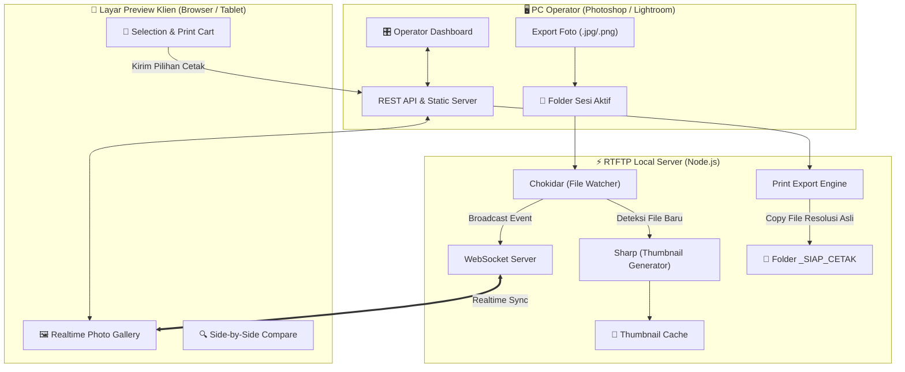

# 📋 Rencana Implementasi: RTFTP (Studio Photo Preview & Selection System)

## 1. Ringkasan Proyek
Sistem server lokal (LAN) berbasis web untuk studio foto yang menghubungkan **PC Operator** (fotografer/editor) dengan **Layar Preview Klien** (PC client / Tablet / Smart TV). Foto yang diekspor oleh operator akan muncul secara *real-time* di layar klien untuk dilihat, dibandingkan, dipilih, dan dikirim ke antrean cetak (*print queue*).

---

## 2. Arsitektur Sistem



---

## 3. Komponen & Fitur Utama

### A. Backend Server (Node.js & WebSocket)
1. **Live Folder Watcher (`chokidar`):**
   - Memantau folder sesi secara otomatis.
   - Mendeteksi penambahan file baru (`add`), perubahan (`change`), atau penghapusan file (`unlink`).
2. **High-Speed Thumbnail Engine (`sharp`):**
   - Menghasilkan thumbnail resolusi sedang (~1200px webp/jpeg) on-the-fly dengan caching instan.
   - Mencegah browser klien lag akibat memuat file foto asli (20–50 Megapixel).
3. **Session & Print Manager:**
   - Endpoint untuk mengganti sesi / folder yang sedang aktif.
   - Endpoint untuk menerima daftar foto yang dipilih klien.
   - Engine otomatis yang menyalin file resolusi tinggi asli ke folder `[Sesi]/_SIAP_CETAK/`.

### B. Layar Preview Klien (Customer View)
1. **Real-time Live Feed:**
   - Foto baru langsung muncul dengan animasi smooth saat diekspor oleh operator.
2. **Interactive Gallery & Lightbox:**
   - Grid thumbnail dengan lazy loading.
   - Fullscreen Lightbox dengan zoom in/out halus (cek ketajaman mata & senyum).
3. **Side-by-Side Comparison (Bandingkan Foto):**
   - Memilih 2–4 foto untuk dibandingkan berdampingan di satu layar secara presisi.
4. **Sistem Pemilihan Cetak (Print Selection):**
   - Tombol "Pilih untuk Cetak" (Heart / Checkbox).
   - Opsi pemilihan ukuran cetak (contoh: 4R, 10R, 12R) dan jumlah lembar (*quantity*).
   - Ringkasan keranjang cetak sebelum konfirmasi.

### C. Dashboard Operator (Operator Control)
1. **Session Selector:** Memilih folder foto klien mana yang aktif.
2. **Live Monitoring:** Memantau berapa foto yang sudah dipilih oleh klien secara *real-time*.
3. **Print Action:** Tombol 1-klik untuk generate folder cetak atau mengekspor rekap order.

---

## 4. Tahapan Pengerjaan (Roadmap)

| Tahap | Fokus Pekerjaan | Output / Deliverable |
| :--- | :--- | :--- |
| **Fase 1** | **Setup Project & Backend Watcher** | - Inisialisasi Node.js project & dependencies (`express`, `ws`, `chokidar`, `sharp`).<br>- Service pemantau folder dan generator thumbnail instan. |
| **Fase 2** | **Frontend Gallery & Real-time Sync** | - UI Galeri Dark Mode profesional (estetik studio foto).<br>- Koneksi WebSocket untuk pembaruan foto otomatis secara realtime. |
| **Fase 3** | **Fitur Lightbox, Zoom & Compare** | - Lightbox fullscreen dengan deep zoom & pan.<br>- Mode komparasi foto berdampingan (Side-by-Side 2-4 foto). |
| **Fase 4** | **Sistem Seleksi Cetak & Hand-off** | - Keranjang pilihan cetak klien (pilih ukuran & qty).<br>- Tombol konfirmasi dan sinkronisasi ke operator. |
| **Fase 5** | **Dashboard Operator & Auto-Export Cetak** | - Panel ganti folder sesi.<br>- Otomatisasi penyalinan file terpilih ke folder `_SIAP_CETAK`. |
| **Fase 6** | **Testing & Optimasi Jaringan Lokal (LAN)** | - Pengujian multi-perangkat (PC klien, iPad/Tablet via Wi-Fi).<br>- Panduan menjalankan server di Windows. |

---

## 5. Rencana Struktur Folder Project

```text
RTFTP/
├── server/
│   ├── server.js            # Entry point Express & WebSocket
│   ├── watcher.js           # File watcher (Chokidar)
│   ├── thumbnail.js         # Image optimization & caching (Sharp)
│   └── routes/              # API endpoints (sessions, print, config)
├── public/                  # Frontend Web App
│   ├── index.html           # Layar Preview Klien
│   ├── operator.html        # Dashboard Kontrol Operator
│   ├── css/
│   │   ├── style.css        # Premium Dark Mode Design System
│   │   └── compare.css      # Style untuk Side-by-side Comparison
│   └── js/
│       ├── app.js           # Gallery logic & WebSocket client
│       ├── lightbox.js      # Zoom & Lightbox engine
│       └── compare.js       # Fitur komparasi foto
├── cache/                   # Tempat penyimpanan thumbnail otomatis
├── package.json
└── README.md
```
